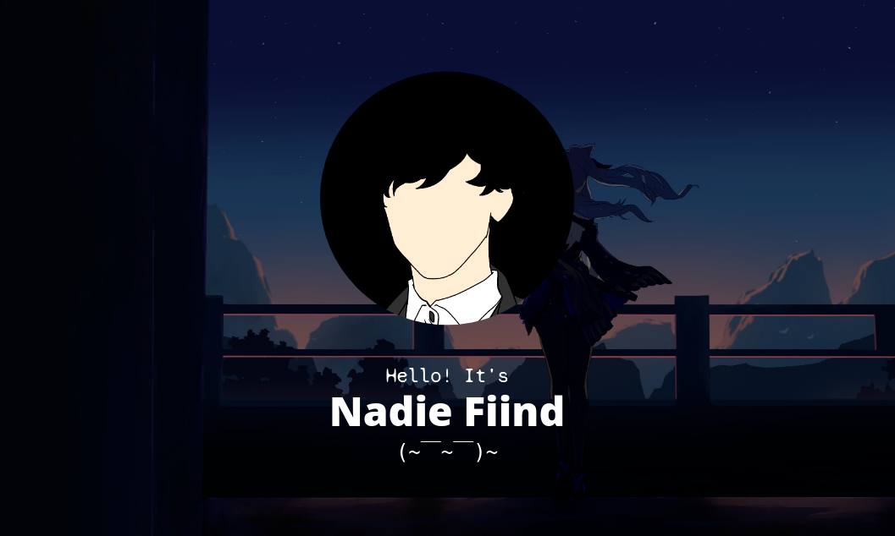

# ⬜⬜⬜⬛⬛⬛⬛⬛⬛⬛ 30% Nadie



### Built With MERN Stack
<br />
<br />
<br />


### Featured Libraries and Frameworks
<a href="https://github.com/pyfyre/pyfyre" target="_blank"></a>
<a href="https://github.com/pallets/flask" target="_blank"></a>
<a href="https://github.com/Rapptz/discord.py" target="_blank"></a>

### Installation
1. Open [Discord](https://discord.com/login)
2. Add this user to your friends:  
<a href="https://discord.com/users/459745032811839500" target="_blank"></a>
3. Send the following message:
```discord
sudo say "Hi!"
```

### Changelog
[STYLED_README.md#changelog](STYLED_README.md#changelog)
